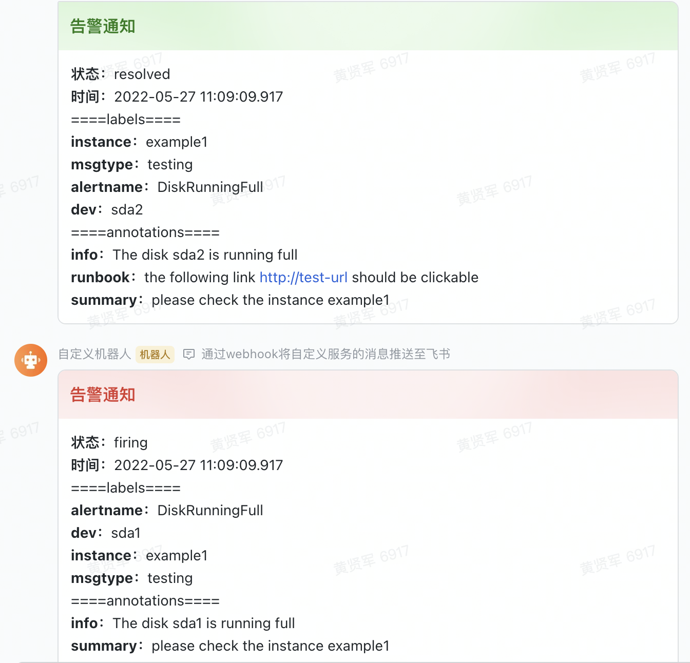

# whf
webhook forwarding, 支持alertmanager转发至企业微信和飞书机器人，支持任意的post webhook转任意的post webhook，javascript动态脚本任意扩展，支持docker

## 打包文件
```
    1. export GOPROXY=https://goproxy.io,direct
    2. go mod tidy 
    3. go build main.go -o whf
    4 ./whf

    支持更换js文件目录和调整端口
    ./whf -t /data/js -p 9090
```
## docker启动
项目中集成了docker和docker-compose.yml, 可以自行选择。   
dockerhub [地址](https://hub.docker.com/r/midaug/whf)。 

docker run 方式
```bash

docker run --name whf --rm -it \
    -v /xxxx/js:/data/js \
    -p 9090:9090 \
    midaug/whf:latest
```

docker-compose 方式，需要按下面配置docker-compose.yaml文件，然后执行 docker-compose up -d

```yaml
version: '3'
services:
  whf:
    image: midaug/whf:latest
    container_name: whf
    restart: always
    network_mode: bridge
    volumes:
      - /xxxx/js:/data/js:ro
    ports:
      - "9090:9090"
```

## 配置请求方式
支持alertmanager

```yaml
# alertmanager.yaml 中配置，url中的u参数可以换企业微信的webhook地址，当然tn模板需要自行添加解析
receivers:
  - name: default
    webhook_configs:
      - send_resolved: true
        url: "http://127.0.0.1:9090/send?u=https://open.feishu.cn/open-apis/bot/v2/hook/xxxxxxxxx&tn=am2feishu&title=告警通知"
```

支持grafana
```
 1. 在grafana中配置webhook
 2. Webhook settings里添写 
    http://127.0.0.1:9090/send?u=https://open.feishu.cn/open-apis/bot/v2/hook/xxxxxxxxx&tn=grafana2feishu&title=告警通知
 3. 点击Send Test 
 
 备注：tn参数为js模板文件的名称，grafana的解析可以自行添加js文件进行转换
```
## 备注
现有的模板支持发送飞书的卡片消息。   
消息效果示例，具体样式可修改js模板参照飞书或企业微信文档进行调整。

